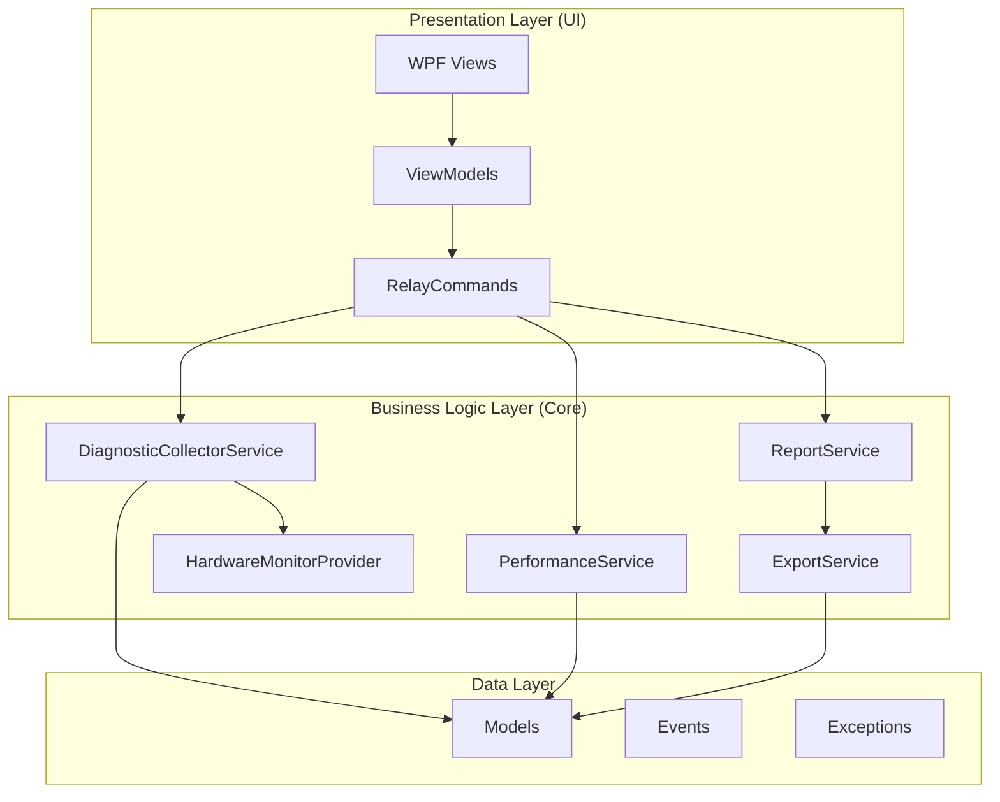
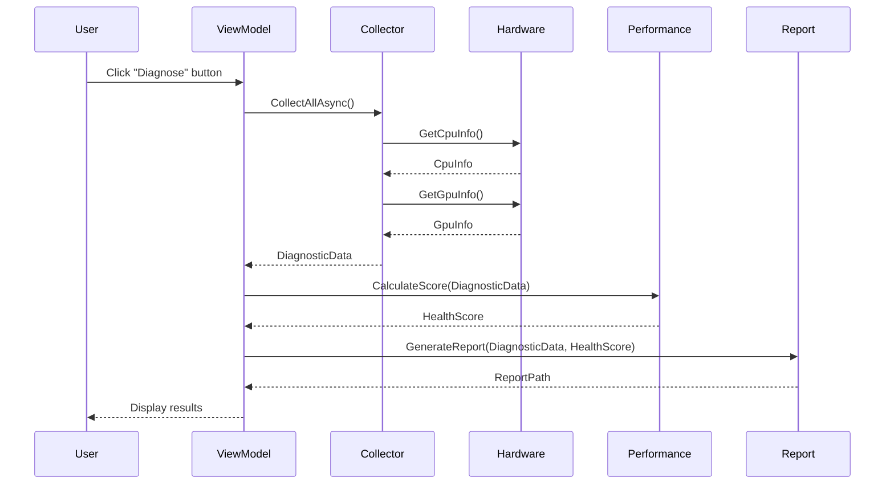

# Architecture Design

DigYourWindows adopts a dual-layer architecture design, achieving clear separation between business logic and UI presentation.

## Layered Architecture

## Core Services

| Service | Responsibility |
|---------|---------------|
| `DiagnosticCollectorService` | Coordinates all data collection |
| `HardwareMonitorProvider` | Singleton wrapper for hardware monitoring |
| `PerformanceService` | Health scoring algorithm |
| `ReportService` | HTML/JSON report generation |
| `ExportService` | File export functionality |

## Data Flow

## Design Decisions

### Why Dual-Layer Architecture?

1. **Separation of Concerns** - UI handles display only, Core handles business logic only
2. **Testability** - Core layer can be unit tested independently
3. **Maintainability** - UI changes don't affect business logic

### Why CommunityToolkit.Mvvm?

1. **Source Generators** - `[ObservableProperty]` and `[RelayCommand]` reduce boilerplate
2. **Performance Optimized** - Compile-time code generation, no runtime reflection
3. **Microsoft Official** - Part of .NET Community Toolkit

### Why LibreHardwareMonitor?

1. **Comprehensive Coverage** - Supports CPU, GPU, motherboard, disk, network, etc.
2. **Open Source & Free** - MIT license, commercial use allowed
3. **Active Maintenance** - Continuous updates for latest hardware
