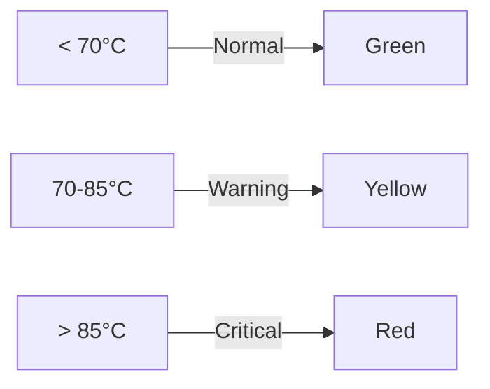

# System Health Scoring Algorithm

DigYourWindows uses a comprehensive scoring algorithm to evaluate system health from multiple dimensions.

## Scoring Dimensions

System health score consists of four dimensions:

| Dimension | Weight | Evaluation Content |
|-----------|--------|-------------------|
| Stability | 30% | System crashes, BSOD, abnormal shutdowns |
| Performance | 30% | CPU/memory/disk load |
| Memory | 20% | Memory usage, available memory |
| Disk | 20% | Disk space, SMART status |

## Scoring Formula

```
Total Score = Stability × 0.30 + Performance × 0.30 + Memory × 0.20 + Disk × 0.20
```

## Dimension Scoring Details

### Stability Score (30%)

Based on Windows Reliability Monitor data:

| Score | Condition |
|-------|-----------|
| 100 | No crashes in last 30 days |
| 90-99 | 1-2 software crashes in last 30 days |
| 70-89 | 3-5 crashes or 1 BSOD in last 30 days |
| 50-69 | 6-10 crashes or 2 BSODs in last 30 days |
| 0-49 | >10 crashes or 3+ BSODs in last 30 days |

### Performance Score (30%)

Combined CPU, memory, and disk load:

```
Performance Score = CPU × 0.4 + Memory Load × 0.4 + Disk IO × 0.2
```

### Memory Score (20%)

| Score | Memory Usage |
|-------|--------------|
| 100 | < 50% |
| 90 | 50-60% |
| 80 | 60-70% |
| 60 | 70-80% |
| 40 | 80-90% |
| 20 | > 90% |

### Disk Score (20%)

Combined disk space and SMART status:

```
Disk Score = Space Score × 0.5 + SMART Score × 0.5
```

## Threshold Definitions

### CPU Temperature Thresholds



### GPU Temperature Thresholds

| Status | Temperature Range | Indicator |
|--------|-------------------|-----------|
| Normal | < 75°C | 🟢 Green |
| Warning | 75-90°C | 🟡 Yellow |
| Critical | > 90°C | 🔴 Red |

### Disk Health Thresholds

| Metric | Normal | Warning | Critical |
|--------|--------|---------|----------|
| Space Used | < 80% | 80-90% | > 90% |
| SMART Status | OK | Warning | Bad |

## Score Levels

| Total Score | Level | Description |
|-------------|-------|-------------|
| 90-100 | Excellent | System in optimal condition |
| 70-89 | Good | System running normally |
| 50-69 | Fair | Potential issues exist |
| 30-49 | Poor | Optimization needed |
| 0-29 | Critical | Immediate attention required |

## Optimization Suggestions

Based on the score results, the system automatically generates optimization suggestions:

- **High Score (90+)** - "System in excellent condition, maintain good habits"
- **Medium (50-89)** - Specific suggestions for low-scoring items
- **Low Score (< 50)** - List urgent issues, recommend immediate action
