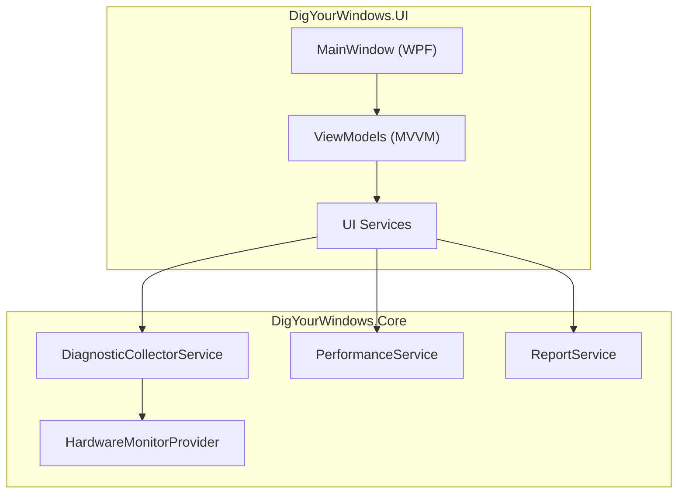

# Technical Whitepaper

DigYourWindows is a Windows deep diagnostics tool built with .NET 10 + WPF, following OpenSpec specification-driven development.

## Overview

DigYourWindows provides a one-stop Windows system diagnostics solution:

- **Hardware Information Collection** - Comprehensive CPU, GPU, memory, disk, network, USB device information
- **Event Log Analysis** - Automatic System/Application error and warning extraction
- **System Health Scoring** - Comprehensive assessment of stability, performance, memory, disk with 0-100 score
- **Smart Optimization Suggestions** - Automatic targeted recommendations based on analysis results

## Technology Stack

| Dimension | Choice |
|-----------|--------|
| Runtime Framework | .NET 10 + WPF |
| UI Component Library | WPF-UI 4.0 (Fluent Design) |
| MVVM Framework | CommunityToolkit.Mvvm 8.4 |
| Charting Library | ScottPlot 5.1 |
| Hardware Monitoring | LibreHardwareMonitorLib 0.9.4 |
| Testing Framework | xUnit 2.9 + FsCheck 2.16 |

## Architecture Highlights

## Development Methodology

The project follows **Spec-Driven Development (SDD)**:

1. **Specification First** - All features defined in `openspec/specs/`
2. **Acceptance Driven** - Given/When/Then format for acceptance criteria
3. **Test Coverage** - 80%+ code coverage required

## Documentation Navigation

- [Architecture Design](/en-US/architecture/) - Layered architecture, service design, data flow
- [OpenSpec Specification](/en-US/openspec/) - Spec-Driven Development workflow
- [Health Scoring Algorithm](/en-US/scoring/) - Scoring weights, threshold design
