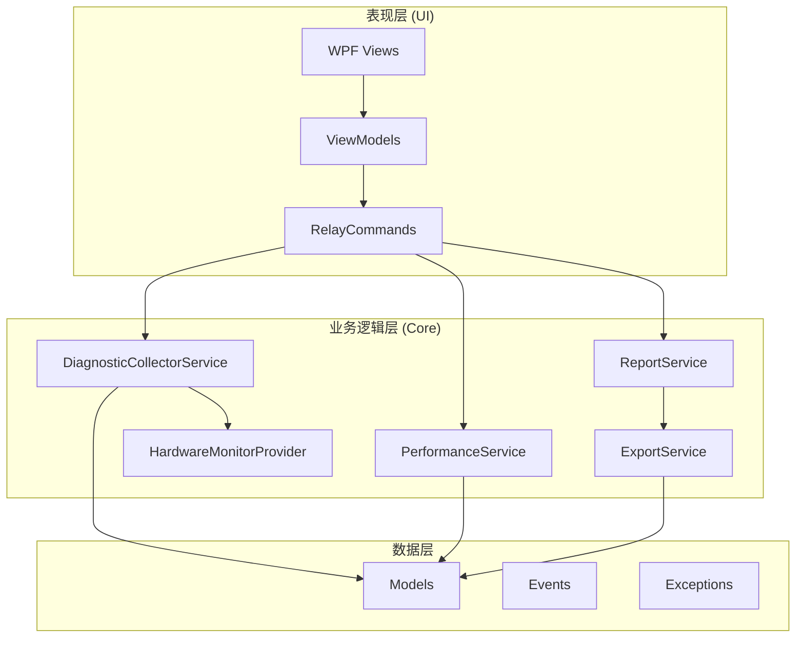
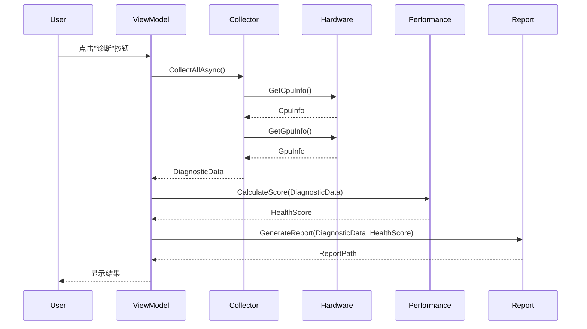

# 架构设计

DigYourWindows 采用双层架构设计，实现业务逻辑与 UI 展示的清晰分离。

## 分层架构

## 核心服务

| 服务 | 职责 |
|------|------|
| `DiagnosticCollectorService` | 协调所有数据采集 |
| `HardwareMonitorProvider` | 硬件监控单例封装 |
| `PerformanceService` | 健康评分算法 |
| `ReportService` | HTML/JSON 报告生成 |
| `ExportService` | 文件导出功能 |

## 数据流

## 设计决策

### 为什么选择双层架构？

1. **关注点分离** - UI 只负责展示，Core 只负责业务逻辑
2. **可测试性** - Core 层可以独立进行单元测试
3. **可维护性** - 修改 UI 不影响业务逻辑

### 为什么选择 CommunityToolkit.Mvvm？

1. **源生成器** - 使用 `[ObservableProperty]` 和 `[RelayCommand]` 减少样板代码
2. **性能优化** - 编译时生成代码，无运行时反射开销
3. **微软官方** - 属于 .NET Community Toolkit 的一部分

### 为什么选择 LibreHardwareMonitor？

1. **全面覆盖** - 支持 CPU、GPU、主板、磁盘、网络等
2. **开源免费** - MIT 协议，可商业使用
3. **活跃维护** - 持续更新支持最新硬件
