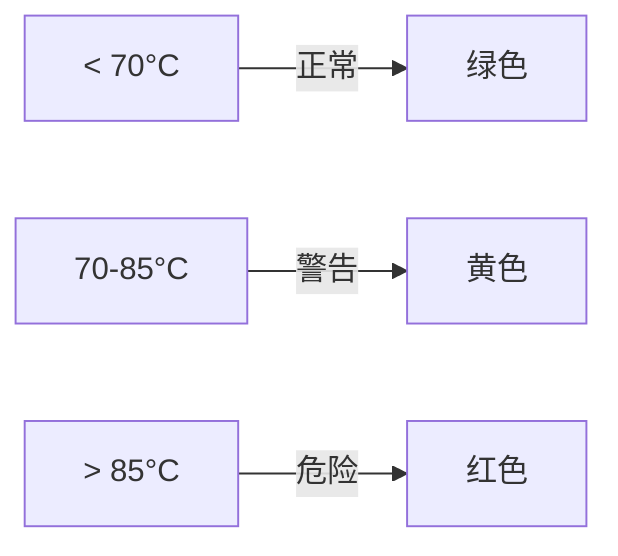

# 系统健康评分算法

DigYourWindows 使用综合评分算法，从多个维度评估系统健康状态。

## 评分维度

系统健康评分由四个维度组成：

| 维度 | 权重 | 评估内容 |
|------|------|----------|
| 稳定性 | 30% | 系统崩溃、蓝屏、异常关机 |
| 性能 | 30% | CPU/内存/磁盘负载 |
| 内存 | 20% | 内存使用率、可用内存 |
| 磁盘 | 20% | 磁盘空间、SMART 状态 |

## 评分公式

```
总分 = 稳定性得分 × 0.30 + 性能得分 × 0.30 + 内存得分 × 0.20 + 磁盘得分 × 0.20
```

## 各维度评分细则

### 稳定性评分 (30%)

基于 Windows 可靠性监视器数据：

| 评分 | 条件 |
|------|------|
| 100 | 近 30 天无崩溃 |
| 90-99 | 近 30 天 1-2 次软件崩溃 |
| 70-89 | 近 30 天 3-5 次崩溃或 1 次蓝屏 |
| 50-69 | 近 30 天 6-10 次崩溃或 2 次蓝屏 |
| 0-49 | 近 30 天超过 10 次崩溃或 3 次以上蓝屏 |

### 性能评分 (30%)

综合 CPU、内存、磁盘负载：

```
性能得分 = CPU得分 × 0.4 + 内存负载得分 × 0.4 + 磁盘IO得分 × 0.2
```

### 内存评分 (20%)

| 评分 | 内存使用率 |
|------|-----------|
| 100 | < 50% |
| 90 | 50-60% |
| 80 | 60-70% |
| 60 | 70-80% |
| 40 | 80-90% |
| 20 | > 90% |

### 磁盘评分 (20%)

综合磁盘空间和 SMART 状态：

```
磁盘得分 = 空间得分 × 0.5 + SMART得分 × 0.5
```

## 阈值定义

### CPU 温度阈值



### GPU 温度阈值

| 状态 | 温度范围 | 指示 |
|------|----------|------|
| 正常 | < 75°C | 🟢 绿色 |
| 警告 | 75-90°C | 🟡 黄色 |
| 危险 | > 90°C | 🔴 红色 |

### 磁盘健康阈值

| 指标 | 正常 | 警告 | 危险 |
|------|------|------|------|
| 使用空间 | < 80% | 80-90% | > 90% |
| SMART 状态 | OK | Warning | Bad |

## 评分等级

| 总分 | 等级 | 说明 |
|------|------|------|
| 90-100 | 优秀 | 系统状态极佳 |
| 70-89 | 良好 | 系统运行正常 |
| 50-69 | 一般 | 存在潜在问题 |
| 30-49 | 较差 | 需要优化 |
| 0-29 | 危险 | 需要立即处理 |

## 优化建议生成

根据评分结果，系统会自动生成优化建议：

- **高分 (90+)** - "系统状态极佳，保持良好使用习惯"
- **中等 (50-89)** - 针对低分项提供具体建议
- **低分 (< 50)** - 列出紧急问题，建议立即处理
