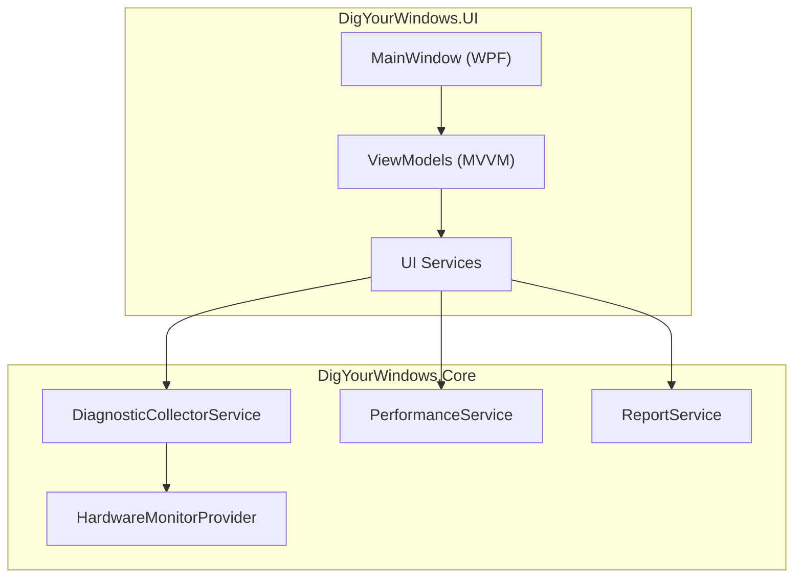

# 技术白皮书

DigYourWindows 是一款 Windows 深度诊断工具，采用 .NET 10 + WPF 构建，基于 OpenSpec 规范驱动开发。

## 概述

DigYourWindows 旨在提供一站式 Windows 系统诊断解决方案：

- **硬件信息采集** - 全面收集 CPU、GPU、内存、磁盘、网络、USB 设备信息
- **事件日志分析** - 自动提取 System/Application 错误和警告
- **系统健康评分** - 综合评估稳定性、性能、内存、磁盘，生成 0-100 健康评分
- **智能优化建议** - 基于分析结果自动生成针对性建议

## 技术定位

| 维度 | 选型 |
|------|------|
| 运行框架 | .NET 10 + WPF |
| UI 组件库 | WPF-UI 4.0 (Fluent Design) |
| MVVM 框架 | CommunityToolkit.Mvvm 8.4 |
| 图表库 | ScottPlot 5.1 |
| 硬件监控 | LibreHardwareMonitorLib 0.9.4 |
| 测试框架 | xUnit 2.9 + FsCheck 2.16 |

## 架构亮点

## 开发规范

项目采用 **Spec-Driven Development (SDD)** 开发模式：

1. **先规范，后代码** - 所有功能在 `openspec/specs/` 中定义
2. **验收驱动** - 使用 Given/When/Then 格式定义验收标准
3. **测试覆盖** - 要求 80% 以上的代码覆盖率

## 文档导航

- [架构设计](/zh-CN/architecture/) - 双层架构、服务层设计、数据流
- [OpenSpec 规范](/zh-CN/openspec/) - Spec-Driven Development 工作流
- [健康评分算法](/zh-CN/scoring/) - 评分权重、阈值设计
